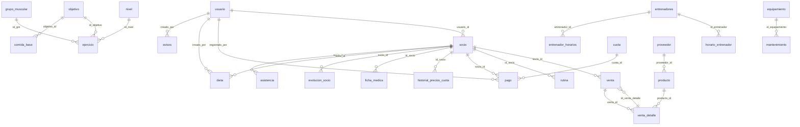

# Auditoría de base de datos, DER y APIs/RPC — Gym Master
**Fecha:** 2026-05-19  
**Base analizada:** `backup_completo_gym_master_19052026.sql`  
**Repositorio analizado:** `gym-master_repo_2026-05-19_20-01.zip`  
**Estado de arquitectura:** single-tenant por instancia/deploy; `dbName` queda fuera del modelo vigente.
## 1. Resumen ejecutivo
El proyecto ya tiene una base de datos extensa y varias funcionalidades avanzadas implementadas en PostgreSQL/Supabase. Se detectaron tablas operativas para usuarios, socios, rutinas, dietas, asistencia, pagos, ventas, equipamiento, mantenimiento, entrenadores, ficha médica, perfil/foto, QR/kiosco y métricas. También existen procedimientos almacenados para generación de rutinas, generación de dietas, ficha médica, asistencia, pagos, equipamiento y análisis de rutinas.

El punto más importante de esta auditoría es que **Data Science no está vacío**: hay RPC/procedimientos ya creados y APIs Next.js que los consumen. El trabajo pendiente no es únicamente backend, sino especialmente **ordenar la capa visual de Business Intelligence**, completar endpoints faltantes y corregir inconsistencias del modelo.

## 2. Inventario de tablas detectadas
| Tabla | Filas en dump | Observación funcional |
|---|---:|---|
| `access_scan_events` | 21 | Eventos de escaneo/kiosco. |
| `actividad` | 16 | Actividades. |
| `asistencia` | 476 | Registros de ingreso/egreso de socios. |
| `avisos` | 6 | Comunicaciones/avisos. |
| `comida_base` | 28 | Base para generación de dietas. |
| `cuota` | 12 | Cuotas/precios y período. |
| `dia` | 6 | Catálogo de días. |
| `dieta` | 8 | Dietas/planes alimenticios; requiere revisión de campo JSON. |
| `ejercicio` | 47 | Catálogo de ejercicios. |
| `entrenador_horarios` | 24 | Bloques horarios normalizados para entrenadores. |
| `entrenadores` | 13 | Datos principales de entrenadores. |
| `equipamiento` | 53 | Inventario de máquinas/accesorios. |
| `evento_profile_photo_updated` | 5 | Auditoría de cambios de foto. |
| `evolucion_socio` | 5 | Medidas físicas/evolución del socio. |
| `ficha_medica` | 4 | Ficha médica histórica del socio. |
| `grupo_muscular` | 15 | Catálogo de grupos musculares. |
| `historial_precios_cuota` | 20 | Pendiente de clasificar. |
| `horario_entrenador` | 18 | Tabla similar/duplicada que debe revisarse. |
| `kiosk_config` | 1 | Configuración de pantalla de recepción. |
| `logs_qr` | 502 | Logs de escaneo QR. |
| `mantenimiento` | 54 | Historial de mantenimiento por equipamiento. |
| `nivel` | 3 | Catálogo de niveles. |
| `objetivo` | 10 | Catálogo de objetivos. |
| `otros_gastos` | 6 | Gastos operativos. |
| `pago` | 16 | Pagos de cuota por socio. |
| `producto` | 0 | Productos vendidos. |
| `proveedor` | 6 | Proveedores. |
| `rutina` | 17 | Rutinas generadas/guardadas en JSONB. |
| `servicio` | 8 | Servicios ofrecidos. |
| `socio` | 13 | Perfil operativo del socio; se relaciona con usuario. |
| `usuario` | 17 | Usuarios de acceso y roles. |
| `venta` | 9 | Ventas. |
| `venta_detalle` | 8 | Detalle de ventas. |

## 3. Columnas por tabla

### `access_scan_events`
| Columna / definición |
|---|
| `id bigint NOT NULL` |
| `socio_id uuid` |
| `raw_code text NOT NULL` |
| `estado text NOT NULL` |
| `estacion_id text NOT NULL` |
| `etapa text NOT NULL` |
| `etapa_ms integer NOT NULL` |
| `latencia_total_ms integer` |
| `fallback_avatar boolean DEFAULT false` |
| `created_at timestamp with time zone DEFAULT now()` |

### `actividad`
| Columna / definición |
|---|
| `id uuid DEFAULT gen_random_uuid() NOT NULL` |
| `nombre_actividad character varying(100) NOT NULL` |
| `creado_en timestamp with time zone DEFAULT now() NOT NULL` |
| `actualizado_en timestamp with time zone DEFAULT now()` |

### `asistencia`
| Columna / definición |
|---|
| `id uuid DEFAULT gen_random_uuid() NOT NULL` |
| `socio_id uuid NOT NULL` |
| `fecha date NOT NULL` |
| `hora_ingreso time without time zone NOT NULL` |
| `hora_egreso time without time zone` |
| `creado_en timestamp without time zone DEFAULT CURRENT_TIMESTAMP` |
| `actualizado_en timestamp without time zone DEFAULT CURRENT_TIMESTAMP` |

### `avisos`
| Columna / definición |
|---|
| `id uuid DEFAULT gen_random_uuid() NOT NULL` |
| `titulo text NOT NULL` |
| `mensaje text NOT NULL` |
| `tipo text NOT NULL` |
| `fecha_envio timestamp with time zone` |
| `enviar_email boolean DEFAULT false` |
| `enviado boolean DEFAULT false` |
| `activo boolean DEFAULT true` |
| `creado_por uuid` |
| `creado_en timestamp without time zone DEFAULT now()` |

### `comida_base`
| Columna / definición |
|---|
| `id uuid DEFAULT gen_random_uuid() NOT NULL` |
| `tipo_comida text` |
| `objetivo_id integer` |
| `descripcion text` |
| `calorias_aprox integer` |
| `proteinas_aprox numeric` |
| `carbohidratos_aprox numeric` |
| `grasas_aprox numeric` |

### `cuota`
| Columna / definición |
|---|
| `id uuid DEFAULT gen_random_uuid() NOT NULL` |
| `descripcion character varying(255) NOT NULL` |
| `monto numeric(10,2) NOT NULL` |
| `periodo character varying(20)` |
| `fecha_inicio date NOT NULL` |
| `fecha_fin date NOT NULL` |
| `creado_en timestamp without time zone DEFAULT CURRENT_TIMESTAMP` |
| `actualizado_en timestamp without time zone DEFAULT CURRENT_TIMESTAMP` |
| `activo boolean` |

### `dia`
| Columna / definición |
|---|
| `id_dia integer NOT NULL` |
| `nombre_dia character varying(50) NOT NULL` |
| `creado_en timestamp without time zone DEFAULT now()` |
| `actualizado_en timestamp without time zone DEFAULT now()` |

### `dieta`
| Columna / definición |
|---|
| `id uuid DEFAULT gen_random_uuid() NOT NULL` |
| `socio_id uuid` |
| `nombre_plan text` |
| `objetivo text` |
| `observaciones text` |
| `fecha_inicio date` |
| `fecha_fin date` |
| `creado_por uuid` |
| `created_at timestamp without time zone DEFAULT now()` |
| `updated_at timestamp without time zone` |

### `ejercicio`
| Columna / definición |
|---|
| `id_ejercicio integer NOT NULL` |
| `nombre_ejercicio character varying(150) NOT NULL` |
| `id_nivel integer NOT NULL` |
| `id_objetivo integer NOT NULL` |
| `id_gm integer NOT NULL` |
| `imagen text` |
| `creado_en timestamp without time zone DEFAULT now()` |
| `actualizado_en timestamp without time zone DEFAULT now()` |

### `entrenador_horarios`
| Columna / definición |
|---|
| `id integer NOT NULL` |
| `entrenador_id uuid NOT NULL` |
| `dia_semana text NOT NULL` |
| `hora_desde time without time zone NOT NULL` |
| `hora_hasta time without time zone NOT NULL` |
| `created_at timestamp without time zone DEFAULT CURRENT_TIMESTAMP` |

### `entrenadores`
| Columna / definición |
|---|
| `id uuid DEFAULT gen_random_uuid() NOT NULL` |
| `nombre_completo text NOT NULL` |
| `dni character varying(15) NOT NULL` |
| `fecha_alta date DEFAULT CURRENT_DATE NOT NULL` |
| `activo boolean DEFAULT true NOT NULL` |
| `horarios_texto text` |
| `created_at timestamp without time zone DEFAULT CURRENT_TIMESTAMP` |
| `updated_at timestamp without time zone DEFAULT CURRENT_TIMESTAMP` |

### `equipamiento`
| Columna / definición |
|---|
| `id uuid DEFAULT gen_random_uuid() NOT NULL` |
| `nombre character varying(100) NOT NULL` |
| `tipo character varying(50)` |
| `marca character varying(100)` |
| `modelo character varying(100)` |
| `ubicacion character varying(100)` |
| `estado character varying(20) DEFAULT 'operativo'::character varying` |
| `fecha_adquisicion date` |
| `ultima_revision date` |
| `proxima_revision date` |
| `observaciones text` |
| `creado_en timestamp without time zone DEFAULT CURRENT_TIMESTAMP` |
| `actualizado_en timestamp without time zone DEFAULT CURRENT_TIMESTAMP` |
| `activo boolean DEFAULT true NOT NULL` |

### `evento_profile_photo_updated`
| Columna / definición |
|---|
| `id bigint NOT NULL` |
| `user_id uuid NOT NULL` |
| `rol text` |
| `old_url text` |
| `new_url text NOT NULL` |
| `event_ts timestamp with time zone DEFAULT now() NOT NULL` |
| `source_ip inet` |
| `user_agent text` |

### `evolucion_socio`
| Columna / definición |
|---|
| `id uuid DEFAULT gen_random_uuid() NOT NULL` |
| `socio_id uuid` |
| `fecha date NOT NULL` |
| `peso numeric` |
| `cintura numeric` |
| `bicep numeric` |
| `tricep numeric` |
| `pierna numeric` |
| `gluteos numeric` |
| `pantorrilla numeric` |
| `altura numeric` |
| `observaciones text` |
| `created_at timestamp without time zone DEFAULT now()` |
| `imc numeric` |

### `ficha_medica`
| Columna / definición |
|---|
| `id uuid DEFAULT gen_random_uuid() NOT NULL` |
| `id_socio uuid NOT NULL` |
| `altura numeric(5,2) NOT NULL` |
| `peso numeric(5,2) NOT NULL` |
| `imc numeric(5,2) GENERATED ALWAYS AS ((peso / NULLIF(((altura / (100)::numeric) ^ (2)::numeric), (0)::numeric))) STORED` |
| `grupo_sanguineo character varying(5) NOT NULL` |
| `presion_arterial character varying(15) NOT NULL` |
| `frecuencia_cardiaca integer NOT NULL` |
| `alergias text` |
| `medicacion text` |
| `lesiones_previas text` |
| `enfermedades_cronicas text` |
| `cirugias_previas text` |
| `problemas_cardiacos boolean NOT NULL` |
| `problemas_respiratorios boolean NOT NULL` |
| `aprobacion_medica boolean NOT NULL` |
| `archivo_aprobacion text` |
| `fecha_ultimo_control date` |
| `observaciones_entrenador text` |
| `observaciones_medico text` |
| `archivos_adjuntos text[]` |
| `proxima_revision date` |
| `creado_en timestamp without time zone DEFAULT CURRENT_TIMESTAMP` |
| `actualizado_en timestamp without time zone DEFAULT CURRENT_TIMESTAMP` |

### `grupo_muscular`
| Columna / definición |
|---|
| `id_gm integer NOT NULL` |
| `nombre_gp character varying(100) NOT NULL` |
| `creado_en timestamp without time zone DEFAULT now()` |
| `actualizado_en timestamp without time zone DEFAULT now()` |

### `historial_precios_cuota`
| Columna / definición |
|---|
| `id integer NOT NULL` |
| `id_socio uuid` |
| `precio numeric(10,2) NOT NULL` |
| `fecha_inicio date NOT NULL` |
| `fecha_fin date` |

### `horario_entrenador`
| Columna / definición |
|---|
| `id integer NOT NULL` |
| `id_entrenador uuid` |
| `dia_semana text NOT NULL` |
| `hora_inicio time without time zone NOT NULL` |
| `hora_fin time without time zone NOT NULL` |

### `kiosk_config`
| Columna / definición |
|---|
| `id bigint NOT NULL` |
| `estacion_id text` |
| `dur_codigo_ms integer DEFAULT 600` |
| `dur_negro_ms integer DEFAULT 300` |
| `dur_bienvenida_ms integer DEFAULT 1500` |
| `mostrar_pantalla_negro boolean DEFAULT true` |
| `mensaje_bienvenida text DEFAULT 'Bienvenido'::text` |
| `variante_ab text DEFAULT 'A'::text` |
| `updated_at timestamp with time zone DEFAULT now()` |

### `logs_qr`
| Columna / definición |
|---|
| `id integer NOT NULL` |
| `socio_id text` |
| `"timestamp" timestamp without time zone` |
| `dispositivo text` |
| `fecha date` |
| `hora integer` |

### `mantenimiento`
| Columna / definición |
|---|
| `id uuid DEFAULT gen_random_uuid() NOT NULL` |
| `id_equipamiento uuid` |
| `tipo_mantenimiento character varying(50)` |
| `descripcion text` |
| `fecha_mantenimiento date NOT NULL` |
| `tecnico_responsable character varying(100)` |
| `costo numeric(10,2)` |
| `observaciones text` |
| `creado_en timestamp without time zone DEFAULT CURRENT_TIMESTAMP` |
| `estado character varying DEFAULT 'en proceso'::character varying NOT NULL` |

### `nivel`
| Columna / definición |
|---|
| `id_nivel integer NOT NULL` |
| `nombre_nivel character varying(100) NOT NULL` |
| `creado_en timestamp with time zone DEFAULT now() NOT NULL` |
| `actualizado_en timestamp with time zone DEFAULT now()` |

### `objetivo`
| Columna / definición |
|---|
| `id_objetivo integer NOT NULL` |
| `nombre_objetivo character varying(100) NOT NULL` |
| `creado_en timestamp without time zone DEFAULT now()` |
| `actualizado_en timestamp without time zone DEFAULT now()` |

### `otros_gastos`
| Columna / definición |
|---|
| `id uuid DEFAULT gen_random_uuid() NOT NULL` |
| `descripcion text NOT NULL` |
| `monto numeric(10,2) NOT NULL` |
| `fecha date DEFAULT CURRENT_DATE` |
| `creado_en timestamp without time zone DEFAULT CURRENT_TIMESTAMP` |
| `actualizado_en timestamp without time zone DEFAULT CURRENT_TIMESTAMP` |

### `pago`
| Columna / definición |
|---|
| `id uuid DEFAULT gen_random_uuid() NOT NULL` |
| `socio_id uuid NOT NULL` |
| `cuota_id uuid NOT NULL` |
| `fecha_pago date NOT NULL` |
| `monto_pagado numeric(10,2) NOT NULL` |
| `total numeric(10,2) GENERATED ALWAYS AS (monto_pagado) STORED` |
| `registrado_por uuid` |
| `creado_en timestamp without time zone DEFAULT CURRENT_TIMESTAMP` |
| `actualizado_en timestamp without time zone DEFAULT CURRENT_TIMESTAMP` |
| `fecha_vencimiento date` |
| `enviar_email boolean` |

### `producto`
| Columna / definición |
|---|
| `id uuid DEFAULT gen_random_uuid() NOT NULL` |
| `nombre character varying(100) NOT NULL` |
| `descripcion text` |
| `precio numeric(10,2) NOT NULL` |
| `stock integer DEFAULT 0` |
| `proveedor_id uuid` |
| `creado_en timestamp without time zone DEFAULT CURRENT_TIMESTAMP` |
| `actualizado_en timestamp without time zone DEFAULT CURRENT_TIMESTAMP` |

### `proveedor`
| Columna / definición |
|---|
| `id uuid DEFAULT gen_random_uuid() NOT NULL` |
| `nombre character varying(100) NOT NULL` |
| `contacto character varying(100)` |
| `telefono character varying(30)` |
| `direccion text` |
| `creado_en timestamp without time zone DEFAULT CURRENT_TIMESTAMP` |
| `actualizado_en timestamp without time zone DEFAULT CURRENT_TIMESTAMP` |

### `rutina`
| Columna / definición |
|---|
| `id_rutina integer NOT NULL` |
| `id_socio uuid NOT NULL` |
| `rutina_desc jsonb NOT NULL` |
| `creado_en timestamp without time zone DEFAULT now()` |
| `actualizado_en timestamp without time zone DEFAULT now()` |
| `contenido jsonb` |
| `semana integer` |
| `nombre character varying` |

### `servicio`
| Columna / definición |
|---|
| `id uuid DEFAULT gen_random_uuid() NOT NULL` |
| `nombre character varying(100) NOT NULL` |
| `descripcion text` |
| `precio numeric(10,2) NOT NULL` |
| `activo boolean DEFAULT true` |
| `creado_en timestamp without time zone DEFAULT CURRENT_TIMESTAMP` |
| `actualizado_en timestamp without time zone DEFAULT CURRENT_TIMESTAMP` |

### `socio`
| Columna / definición |
|---|
| `id_socio uuid DEFAULT gen_random_uuid() NOT NULL` |
| `usuario_id uuid` |
| `nombre_completo character varying(150) NOT NULL` |
| `dni character varying(20) NOT NULL` |
| `direccion text` |
| `telefono character varying(30)` |
| `activo boolean DEFAULT true NOT NULL` |
| `fecha_alta date DEFAULT CURRENT_DATE` |
| `fecha_baja date` |
| `creado_en timestamp without time zone DEFAULT CURRENT_TIMESTAMP` |
| `actualizado_en timestamp without time zone DEFAULT CURRENT_TIMESTAMP` |
| `foto text` |
| `email character varying(100)` |
| `nivel integer` |
| `objetivo integer` |
| `dias_por_semana integer` |
| `sexo public.sexo_enum` |
| `fecnac date` |
| `descuento_activo boolean DEFAULT false` |

### `usuario`
| Columna / definición |
|---|
| `id uuid DEFAULT gen_random_uuid() NOT NULL` |
| `nombre character varying(100) NOT NULL` |
| `email character varying(100) NOT NULL` |
| `password_hash text NOT NULL` |
| `rol character varying(20) NOT NULL` |
| `activo boolean DEFAULT true` |
| `creado_en timestamp without time zone DEFAULT CURRENT_TIMESTAMP` |
| `actualizado_en timestamp without time zone DEFAULT CURRENT_TIMESTAMP` |
| `sexo character varying(1)` |
| `fecnac date` |
| `nivel character varying` |
| `objetivo character varying` |
| `foto text` |

### `venta`
| Columna / definición |
|---|
| `id uuid DEFAULT gen_random_uuid() NOT NULL` |
| `socio_id uuid` |
| `total numeric(10,2) NOT NULL` |
| `fecha date DEFAULT CURRENT_DATE` |
| `creado_en timestamp without time zone DEFAULT CURRENT_TIMESTAMP` |
| `actualizado_en timestamp without time zone DEFAULT CURRENT_TIMESTAMP` |
| `id_venta_detalle uuid` |

### `venta_detalle`
| Columna / definición |
|---|
| `id uuid DEFAULT gen_random_uuid() NOT NULL` |
| `venta_id uuid NOT NULL` |
| `producto_id uuid NOT NULL` |
| `cantidad integer NOT NULL` |
| `precio_unitario numeric(10,2) NOT NULL` |
| `subtotal numeric(10,2) GENERATED ALWAYS AS (((cantidad)::numeric * precio_unitario)) STORED` |
| `creado_en timestamp without time zone DEFAULT CURRENT_TIMESTAMP` |
| `actualizado_en timestamp without time zone DEFAULT CURRENT_TIMESTAMP` |

## 4. Relaciones FK detectadas
| Tabla origen | Columna | Tabla destino | Columna destino | Constraint | Acción |
|---|---|---|---|---|---|
| `asistencia` | `socio_id` | `socio` | `id_socio` | `asistencia_socio_id_fkey` | `ON DELETE CASCADE` |
| `avisos` | `creado_por` | `usuario` | `id` | `avisos_creado_por_fkey` | `-` |
| `comida_base` | `objetivo_id` | `objetivo` | `id_objetivo` | `comida_base_objetivo_id_fkey` | `-` |
| `dieta` | `creado_por` | `usuario` | `id` | `dieta_creado_por_fkey` | `-` |
| `dieta` | `socio_id` | `socio` | `id_socio` | `dieta_socio_id_fkey` | `-` |
| `ejercicio` | `id_gm` | `grupo_muscular` | `id_gm` | `ejercicio_id_gm_fkey` | `-` |
| `ejercicio` | `id_nivel` | `nivel` | `id_nivel` | `ejercicio_id_nivel_fkey` | `-` |
| `ejercicio` | `id_objetivo` | `objetivo` | `id_objetivo` | `ejercicio_id_objetivo_fkey` | `-` |
| `entrenador_horarios` | `entrenador_id` | `entrenadores` | `id` | `entrenador_horarios_entrenador_id_fkey` | `ON DELETE CASCADE` |
| `evolucion_socio` | `socio_id` | `socio` | `id_socio` | `evolucion_socio_socio_id_fkey` | `-` |
| `ficha_medica` | `id_socio` | `socio` | `id_socio` | `ficha_medica_id_socio_fkey` | `ON DELETE CASCADE` |
| `historial_precios_cuota` | `id_socio` | `socio` | `id_socio` | `historial_precios_cuota_id_socio_fkey` | `-` |
| `horario_entrenador` | `id_entrenador` | `entrenadores` | `id` | `horario_entrenador_id_entrenador_fkey` | `-` |
| `mantenimiento` | `id_equipamiento` | `equipamiento` | `id` | `mantenimiento_id_equipamiento_fkey` | `ON DELETE CASCADE` |
| `pago` | `cuota_id` | `cuota` | `id` | `pago_cuota_id_fkey` | `ON DELETE CASCADE` |
| `pago` | `registrado_por` | `usuario` | `id` | `pago_registrado_por_fkey` | `ON DELETE SET NULL` |
| `pago` | `socio_id` | `socio` | `id_socio` | `pago_socio_id_fkey` | `ON DELETE CASCADE` |
| `producto` | `proveedor_id` | `proveedor` | `id` | `producto_proveedor_id_fkey` | `-` |
| `rutina` | `id_socio` | `socio` | `id_socio` | `rutina_id_socio_fkey` | `-` |
| `socio` | `usuario_id` | `usuario` | `id` | `socio_usuario_id_fkey` | `ON DELETE CASCADE` |
| `venta_detalle` | `producto_id` | `producto` | `id` | `venta_detalle_producto_id_fkey` | `-` |
| `venta_detalle` | `venta_id` | `venta` | `id` | `venta_detalle_venta_id_fkey` | `ON DELETE CASCADE` |
| `venta` | `id_venta_detalle` | `venta_detalle` | `id` | `venta_id_venta_detalle_fkey` | `ON UPDATE CASCADE ON DELETE CASCADE` |
| `venta` | `socio_id` | `socio` | `id_socio` | `venta_socio_id_fkey` | `-` |

## 5. DER conceptual actual

## 6. Procedimientos almacenados / funciones detectadas
| Función/RPC | Argumentos | Retorno | Lenguaje | Usada desde código | Estado |
|---|---|---|---|---|---|
| `actualizar_horarios_texto` | `` | `trigger` | `plpgsql` | - | 🟡 existe en DB; uso no detectado en repo |
| `actualizar_updated_at` | `` | `trigger` | `plpgsql` | - | 🟡 existe en DB; uso no detectado en repo |
| `attendance_ranking` | `p_year integer DEFAULT (EXTRACT(year FROM (now() AT TIME ZONE 'America/Argentina/Cordoba'::text)))::integer, p_month integer DEFAULT (EXTRACT(month FROM (now() AT TIME ZONE 'America/Argentina/Cordoba'::text)))::integer, p_limit integer DEFAULT 10` | `TABLE(socio_id uuid, nombre text, dias_asistidos integer)` | `sql` | - | 🟡 existe en DB; uso no detectado en repo |
| `calcular_retencion_por_combinacion` | `` | `TABLE(objetivo integer, nivel integer, dias_por_semana integer, tasa_retencion numeric)` | `plpgsql` | `src/services/rutinaService.ts` | ✅ usada por frontend/backend |
| `fn_top10_asistencia` | `m_mes integer, m_anio integer` | `TABLE(socio_id uuid, nombre_completo text, total_asistencias bigint, ranking integer)` | `sql` | - | 🟡 existe en DB; uso no detectado en repo |
| `genera_dieta_socio` | `p_socio_id uuid, p_objetivo_id integer, p_fecha_inicio date, p_fecha_fin date, p_usuario uuid` | `void` | `plpgsql` | `src/services/dietaService.ts` | ✅ usada por frontend/backend |
| `generar_horarios_texto` | `p_entrenador_id uuid` | `text` | `plpgsql` | `src/services/entrenadorService.ts` | ✅ usada por frontend/backend |
| `generar_rutina_socio` | `p_id_socio uuid, p_id_objetivo integer DEFAULT NULL::integer, p_id_nivel integer DEFAULT NULL::integer, p_dias integer DEFAULT NULL::integer` | `TABLE(id_rutina integer, rutina jsonb)` | `plpgsql` | `src/services/rutinaService.ts` | ✅ usada por frontend/backend |
| `get_ficha_medica_actual` | `p_id_socio uuid` | `public.ficha_medica` | `sql` | `src/services/fichaMedicaService.ts` | ✅ usada por frontend/backend |
| `insert_ficha_medica` | `p_id_socio uuid, p_altura numeric, p_peso numeric, p_grupo_sanguineo character varying, p_presion_arterial character varying, p_frecuencia_cardiaca integer, p_problemas_cardiacos boolean, p_problemas_respiratorios boolean, p_aprobacion_medica boolean, p_alergias text DEFAULT NULL::text, p_medicacion text DEFAULT NULL::text, p_lesiones_previas text DEFAULT NULL::text, p_enfermedades_cronicas text DEFAULT NULL::text, p_cirugias_previas text DEFAULT NULL::text, p_archivo_aprobacion text DEFAULT NULL::text, p_fecha_ultimo_control date DEFAULT NULL::date, p_observaciones_entrenador text DEFAULT NULL::text, p_observaciones_medico text DEFAULT NULL::text, p_archivos_adjuntos text[] DEFAULT NULL::text[], p_proxima_revision date DEFAULT NULL::date` | `public.ficha_medica` | `plpgsql` | `src/services/fichaMedicaService.ts` | ✅ usada por frontend/backend |
| `list_fichas_medicas` | `p_id_socio uuid` | `SETOF public.ficha_medica` | `sql` | `src/services/fichaMedicaService.ts` | ✅ usada por frontend/backend |
| `log_profile_photo_updated` | `` | `trigger` | `plpgsql` | - | 🟡 existe en DB; uso no detectado en repo |
| `obtener_evolucion_cuota` | `` | `TABLE(periodo text, anio integer, mes integer, monto numeric)` | `plpgsql` | - | 🟡 existe en DB; uso no detectado en repo |
| `rls_auto_enable` | `` | `event_trigger` | `plpgsql` | - | 🟡 existe en DB; uso no detectado en repo |
| `set_updated_at` | `` | `trigger` | `plpgsql` | - | 🟡 existe en DB; uso no detectado en repo |
| `sp_adherencia_mensual_rutinas` | `` | `TABLE(socio_id uuid, anio_mes text, asistencias_registradas integer, sesiones_recomendadas integer, porcentaje_adherencia numeric, usuario_id uuid)` | `plpgsql` | `src/services/rutinaService.ts` | ✅ usada por frontend/backend |
| `sp_analisis_conducta_pagos` | `` | `TABLE(socio_id uuid, anio_mes text, cantidad_pagos integer, pagos_puntuales integer, pagos_leve_retraso integer, pagos_morosos integer, porcentaje_puntualidad numeric, porcentaje_morosidad numeric, total_pagado numeric, total_descuento numeric)` | `plpgsql` | `src/services/pagoService.ts` | ✅ usada por frontend/backend |
| `sp_analisis_costo_beneficio` | `` | `TABLE(id uuid, nombre text, fecha_adquisicion date, antiguedad_anios numeric, costo_total_mantenimiento numeric, costo_promedio_anual numeric, valor_reposicion numeric, costo_beneficio_ratio numeric)` | `plpgsql` | `src/services/equipamientoService.ts` | ✅ usada por frontend/backend |
| `sp_concurrencia_anual` | `` | `TABLE(anio integer, sexo public.sexo_enum, asistencias integer)` | `plpgsql` | `src/services/asistenciaService.ts` | ✅ usada por frontend/backend |
| `sp_concurrencia_mensual` | `` | `TABLE(anio integer, mes integer, sexo public.sexo_enum, asistencias integer)` | `plpgsql` | `src/services/asistenciaService.ts` | ✅ usada por frontend/backend |
| `sp_concurrencia_semanal` | `` | `TABLE(anio integer, semana integer, sexo public.sexo_enum, asistencias integer)` | `plpgsql` | `src/services/asistenciaService.ts` | ✅ usada por frontend/backend |
| `sp_estado_equipamiento_semaforo` | `` | `TABLE(id uuid, nombre text, ultima_revision date, proxima_revision date, mantenimientos_ultimos_3m integer, costo_ultimos_3m numeric, estado_semaforo text)` | `plpgsql` | `src/services/equipamientoService.ts` | ✅ usada por frontend/backend |
| `sp_evolucion_promedio_por_objetivo` | `` | `TABLE(id_objetivo integer, "año_mes" text, promedio_asistencias numeric)` | `plpgsql` | `src/services/rutinaService.ts` | ✅ usada por frontend/backend |
| `sp_generar_guardar_rutina_json` | `p_id_socio uuid, p_nivel integer, p_objetivo integer, p_dias integer, p_nombre text DEFAULT 'Rutina personalizada'::text, p_semana integer DEFAULT (EXTRACT(week FROM CURRENT_DATE))::integer` | `jsonb` | `plpgsql` | - | 🟡 existe en DB; uso no detectado en repo |
| `sp_generar_rutina_personalizada` | `p_nivel integer, p_objetivo integer, p_dias integer` | `TABLE(dia text, grupo_muscular text, ejercicio text, series integer, repeticiones integer, descanso text, imagen text)` | `plpgsql` | `src/services/rutinaService.ts` | ✅ usada por frontend/backend |
| `sp_ranking_fallos_equipamiento` | `` | `TABLE(id_equipamiento uuid, nombre text, total_fallos integer, costo_total numeric, ranking integer)` | `plpgsql` | `src/services/equipamientoService.ts` | ✅ usada por frontend/backend |
| `sp_resumen_asistencias_por_periodo` | `p_periodo text DEFAULT 'mensual'::text` | `TABLE(periodo_1 text, periodo_2 text, sexo public.sexo_enum, asistencias integer)` | `plpgsql` | - | 🟡 existe en DB; uso no detectado en repo |
| `sync_socio_foto_desde_usuario` | `` | `trigger` | `plpgsql` | - | 🟡 existe en DB; uso no detectado en repo |
| `tiene_foto` | `_foto text` | `boolean` | `sql` | - | 🟡 existe en DB; uso no detectado en repo |

## 7. RPC llamadas desde el código y validación contra el dump
| RPC invocada en código | Existe en backup | Archivos consumidores | Observación |
|---|---|---|---|
| `calcular_retencion_por_combinacion` | ✅ | `src/services/rutinaService.ts` | OK |
| `genera_dieta_socio` | ✅ | `src/services/dietaService.ts` | OK |
| `generar_horarios_texto` | ✅ | `src/services/entrenadorService.ts` | OK |
| `generar_rutina_socio` | ✅ | `src/services/rutinaService.ts` | OK |
| `get_ficha_medica_actual` | ✅ | `src/services/fichaMedicaService.ts` | OK |
| `insert_ficha_medica` | ✅ | `src/services/fichaMedicaService.ts` | OK |
| `list_fichas_medicas` | ✅ | `src/services/fichaMedicaService.ts` | OK |
| `sp_adherencia_mensual_rutinas` | ✅ | `src/services/rutinaService.ts` | OK |
| `sp_analisis_conducta_pagos` | ✅ | `src/services/pagoService.ts` | OK |
| `sp_analisis_costo_beneficio` | ✅ | `src/services/equipamientoService.ts` | OK |
| `sp_concurrencia_anual` | ✅ | `src/services/asistenciaService.ts` | OK |
| `sp_concurrencia_mensual` | ✅ | `src/services/asistenciaService.ts` | OK |
| `sp_concurrencia_semanal` | ✅ | `src/services/asistenciaService.ts` | OK |
| `sp_estado_equipamiento_semaforo` | ✅ | `src/services/equipamientoService.ts` | OK |
| `sp_evolucion_promedio_por_objetivo` | ✅ | `src/services/rutinaService.ts` | OK |
| `sp_generar_rutina_personalizada` | ✅ | `src/services/rutinaService.ts` | OK |
| `sp_prediccion_abandono` | 🔴 | `src/services/asistenciaService.ts` | FALTA en el dump: la API puede fallar en runtime si no existe en Supabase. |
| `sp_ranking_fallos_equipamiento` | ✅ | `src/services/equipamientoService.ts` | OK |
| `sp_top_inactivos` | 🔴 | `src/services/asistenciaService.ts` | FALTA en el dump: la API puede fallar en runtime si no existe en Supabase. |

## 8. APIs detectadas en `src/app/api`
| Ruta | Métodos detectados |
|---|---|
| `/api/actividades/:id` | `GET` |
| `/api/actividades` | `GET, POST, PUT, DELETE` |
| `/api/admin/metricas/asistencia/:tipo` | `GET` |
| `/api/admin/metricas/asistencia/prediccion-abandono` | `GET` |
| `/api/admin/metricas/asistencia/top-inactivos` | `GET` |
| `/api/admin/metricas/equipamiento/costo-beneficio` | `GET` |
| `/api/admin/metricas/equipamiento/estado-actual` | `GET` |
| `/api/admin/metricas/equipamiento/prediccion-fallo` | `GET` |
| `/api/admin/metricas/equipamiento/top-fallos` | `GET` |
| `/api/admin/metricas/pagos/histograma` | `GET` |
| `/api/admin/metricas/pagos/proyeccion-ingresos` | `GET` |
| `/api/admin/metricas/pagos/segmentacion` | `GET` |
| `/api/admin/metricas/retencion_por_combinacion` | `GET` |
| `/api/admin/metricas/rutinas/adherencia` | `GET` |
| `/api/admin/metricas/rutinas/evolucion-promedio` | `GET` |
| `/api/admin/metricas/rutinas/generar-rutina` | `POST` |
| `/api/admin/metricas/rutinas/generar-rutina-personalizada` | `POST` |
| `/api/asistencias/qr-dia` | `GET` |
| `/api/asistencias/ranking-mensual` | `POST` |
| `/api/asistencias/recientes` | `GET` |
| `/api/asistencias/registro-qr` | `GET, POST` |
| `/api/asistencias` | `GET, POST, PUT, DELETE` |
| `/api/auth/:...nextauth` | `sin método detectado` |
| `/api/avisos/:id` | `GET, PUT, DELETE` |
| `/api/avisos` | `GET, POST` |
| `/api/cuota/:id` | `GET` |
| `/api/cuota` | `GET, POST, PUT, DELETE` |
| `/api/custom-login` | `POST` |
| `/api/dieta/generar` | `POST` |
| `/api/dieta/socio/:id` | `GET` |
| `/api/dieta/todas` | `GET` |
| `/api/entrenadores/:id/horarios` | `GET` |
| `/api/entrenadores/:id` | `GET, PUT` |
| `/api/entrenadores` | `GET, POST` |
| `/api/equipamientos/:id` | `PUT, DELETE` |
| `/api/equipamientos` | `GET, POST` |
| `/api/evolucion_socio/:socio_id` | `GET` |
| `/api/evolucion_socio/registro` | `POST` |
| `/api/file-upload` | `POST` |
| `/api/mantenimientos/:id` | `GET` |
| `/api/mantenimientos/completado/:id` | `PUT` |
| `/api/mantenimientos` | `POST, GET, PUT` |
| `/api/niveles` | `GET` |
| `/api/objetivos` | `GET` |
| `/api/otros_gastos` | `GET, POST, PUT, DELETE` |
| `/api/pagar-cuota` | `POST` |
| `/api/pagos/:id` | `GET` |
| `/api/pagos` | `GET, POST, PUT, DELETE` |
| `/api/productos/:id` | `GET` |
| `/api/productos` | `GET, POST, PUT, DELETE` |
| `/api/proveedores/:id` | `GET` |
| `/api/proveedores` | `GET, POST, PUT, DELETE` |
| `/api/rutina/:idSocio` | `GET` |
| `/api/rutina/generar` | `POST` |
| `/api/rutina/historial/:id_socio` | `GET` |
| `/api/rutina/historial` | `GET` |
| `/api/servicios/:id` | `GET` |
| `/api/servicios` | `GET, POST, PUT, DELETE` |
| `/api/socios/:id/ficha-medica/:id_ficha` | `GET` |
| `/api/socios/:id/ficha-medica/actual` | `GET` |
| `/api/socios/:id/ficha-medica/historial` | `GET` |
| `/api/socios/:id/ficha-medica` | `POST` |
| `/api/socios/:id` | `GET` |
| `/api/socios` | `GET, POST, PUT, DELETE` |
| `/api/stripe-webhook` | `POST` |
| `/api/test-alertas` | `POST` |
| `/api/usuarios/:id/perfil` | `GET` |
| `/api/usuarios/:id` | `GET` |
| `/api/usuarios` | `GET, POST, PUT, DELETE` |
| `/api/ventas/:id` | `GET` |
| `/api/ventas` | `GET, POST, PUT, DELETE` |
| `/api/ventas_detalles` | `GET, POST, PUT, DELETE` |

## 9. APIs de Business Intelligence declaradas en `apiClient.ts`
| Función frontend/API client | Endpoint consumido | Estado visual detectado |
|---|---|---|
| `getEvolucionPromedioRutinas` | `/api/admin/metricas/rutinas/evolucion-promedio` | ✅ consumida en `src/app/dashboard/page.tsx` para cards/gráficas iniciales |
| `getAdherenciaRutinas` | `/api/admin/metricas/rutinas/adherencia` | ✅ consumida en `src/app/dashboard/page.tsx` para cards/gráficas iniciales |
| `generarRutina` | `/api/admin/metricas/rutinas/generar-rutina` | 🟡 API client existe, pero no se detectó uso visual en dashboard principal |
| `getSegmentacionPagos` | `/api/admin/metricas/pagos/segmentacion` | ✅ consumida en `src/app/dashboard/page.tsx` para cards/gráficas iniciales |
| `getProyeccionIngresos` | `/api/admin/metricas/pagos/proyeccion-ingresos` | 🟡 API client existe, pero no se detectó uso visual en dashboard principal |
| `getHistogramaPagos` | `/api/admin/metricas/pagos/histograma` | ✅ consumida en `src/app/dashboard/page.tsx` para cards/gráficas iniciales |
| `getTopFallosEquipamiento` | `/api/admin/metricas/equipamiento/top-fallos` | ✅ consumida en `src/app/dashboard/page.tsx` para cards/gráficas iniciales |
| `getPrediccionFalloEquipamiento` | `/api/admin/metricas/equipamiento/prediccion-fallo` | 🟡 API client existe, pero no se detectó uso visual en dashboard principal |
| `getEstadoActualEquipamiento` | `/api/admin/metricas/equipamiento/estado-actual` | ✅ consumida en `src/app/dashboard/page.tsx` para cards/gráficas iniciales |
| `getCostoBeneficioEquipamiento` | `/api/admin/metricas/equipamiento/costo-beneficio` | 🟡 API client existe, pero no se detectó uso visual en dashboard principal |
| `getTopInactivosAsistencia` | `/api/admin/metricas/asistencia/top-inactivos` | 🟡 API client existe, pero no se detectó uso visual en dashboard principal |
| `getConcurrenciaAsistencia` | `/api/admin/metricas/asistencia/${tipo}` | ✅ consumida en `src/app/dashboard/page.tsx` para cards/gráficas iniciales |

## 10. Hallazgos importantes
### 10.1 Data Science / BI
- Existen RPC de concurrencia, pagos, equipamiento, rutinas y retención.
- Existen API routes en `/api/admin/metricas/...`.
- El dashboard principal ya consume algunas métricas y muestra gráficas iniciales con Chart.js.
- Hay APIs/funciones cliente no utilizadas visualmente todavía: proyección de ingresos, predicción de fallo, costo-beneficio, top inactivos y predicción de abandono.
- En el código se invocan `sp_prediccion_abandono` y `sp_top_inactivos`, pero estas funciones no aparecen en el backup analizado.

### 10.2 Seguridad/RLS
- Todas las tablas públicas principales tienen RLS habilitado.
- Hay policies `dev_all_*` con `USING (true) WITH CHECK (true)`, aptas solo para desarrollo.
- También existen policies de lectura para `authenticated` en varias tablas.
- Antes de producción hay que reemplazar el esquema temporal por policies reales o centralizar operaciones críticas en API routes con service role.

### 10.3 Inconsistencias de modelo
- Hay dos estructuras de horarios de entrenador: `entrenador_horarios` y `horario_entrenador`. Conviene consolidar en una sola.
- `venta` contiene `id_venta_detalle` y `venta_detalle` contiene `venta_id`, generando una relación circular que debe revisarse. El modelo normal suele ser `venta` 1:N `venta_detalle`, sin FK inversa obligatoria.
- La documentación de dieta habla de un JSON `descripcion_json`, pero la tabla `dieta` detectada no tiene esa columna. La función `genera_dieta_socio` arma `dieta_json` y lo inserta en `observaciones`, que es `text`. Conviene crear/normalizar un campo `descripcion_json JSONB` o `plan_json JSONB`.
- La tabla `rutina` tiene `rutina_desc JSONB` y también `contenido JSONB`; conviene definir cuál es la fuente oficial.
- `socio.nivel`, `socio.objetivo` y `socio.dias_por_semana` son claves funcionales para rutinas; hay que asegurar FK/validación consistente contra `nivel` y `objetivo`.
- Algunas columnas usan `created_at/updated_at`, otras `creado_en/actualizado_en`; conviene normalizar gradualmente en documentación y nuevas migraciones.

## 11. Prioridad de corrección sugerida
1. Documentar y validar el DER actual sin tocar producción.
2. Crear scripts de diagnóstico SQL para verificar RPC faltantes, policies abiertas, FKs circulares y tablas duplicadas.
3. Corregir primero RPC faltantes usadas por APIs (`sp_prediccion_abandono`, `sp_top_inactivos`) o deshabilitar/ocultar endpoints hasta implementarlas.
4. Definir migración para dieta JSONB si se confirma que el frontend/backend esperan JSON estructurado.
5. Consolidar horarios de entrenadores.
6. Revisar modelo de ventas antes de ampliar ventas/reportes.
7. Diseñar BI visual como módulo separado del dashboard, no como acumulación de gráficas en el dashboard principal.

## 12. Próximo bloque recomendado
Crear una rama de diagnóstico SQL/documentación: `chore/database-der-audit`. En esa rama no haría cambios destructivos de base todavía. El objetivo es versionar documentación, scripts de diagnóstico y un mapa de APIs/RPC. Luego se abrirá una rama posterior para migraciones correctivas reales.
