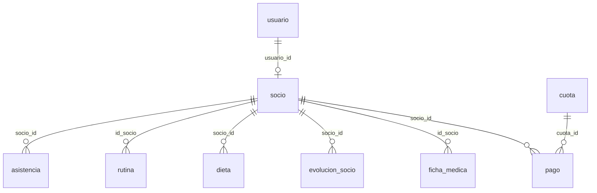

# Estado de base de datos — Gym Master

**Fuente:** `backup_completo_gym_master_19052026.sql`  
**Objetivo:** inventario inicial para construir el DER real y preparar migraciones limpias.

---

## 1. Resumen

- Tablas públicas detectadas: **33**.
- Funciones/RPC públicas detectadas: **29**.
- El backup incluye schemas internos de Supabase (`auth`, `storage`, `realtime`, etc.). Para desarrollo de negocio se debe trabajar principalmente sobre `public`.
- Hay datos de prueba/seed suficientes para validar módulos: socios, usuarios, asistencia, rutinas, ejercicios, dietas, equipamiento y mantenimiento.

---

## 2. Tablas públicas y columnas principales

| Tabla | Filas en backup | Columnas detectadas |
|---|---:|---|
| `public.usuario` | 17 | `id` uuid; `nombre` character varying(100); `email` character varying(100); `password_hash` text; `rol` character varying(20); `activo` boolean; `creado_en` timestamp without time zone; `actualizado_en` timestamp without time zone; `sexo` character varying(1); `fecnac` date; `nivel` character varying; `objetivo` character varying; `foto` text |
| `public.socio` | 13 | `id_socio` uuid; `usuario_id` uuid; `nombre_completo` character varying(150); `dni` character varying(20); `direccion` text; `telefono` character varying(30); `activo` boolean; `fecha_alta` date; `fecha_baja` date; `creado_en` timestamp without time zone; `actualizado_en` timestamp without time zone; `foto` text; `email` character varying(100); `nivel` integer; `objetivo` integer; `dias_por_semana` integer; `sexo` public.sexo_enum; `fecnac` date; `descuento_activo` boolean |
| `public.rutina` | 17 | `id_rutina` integer; `id_socio` uuid; `rutina_desc` jsonb; `creado_en` timestamp without time zone; `actualizado_en` timestamp without time zone; `contenido` jsonb; `semana` integer; `nombre` character varying |
| `public.dieta` | 8 | `id` uuid; `socio_id` uuid; `nombre_plan` text; `objetivo` text; `observaciones` text; `fecha_inicio` date; `fecha_fin` date; `creado_por` uuid; `created_at` timestamp without time zone; `updated_at` timestamp without time zone |
| `public.evolucion_socio` | 5 | `id` uuid; `socio_id` uuid; `fecha` date; `peso` numeric; `cintura` numeric; `bicep` numeric; `tricep` numeric; `pierna` numeric; `gluteos` numeric; `pantorrilla` numeric; `altura` numeric; `observaciones` text; `created_at` timestamp without time zone; `imc` numeric |
| `public.ficha_medica` | 4 | `id` uuid; `id_socio` uuid; `altura` numeric(5,2); `peso` numeric(5,2); `imc` numeric(5,2) GENERATED ALWAYS AS ((peso / NULLIF(((altura / (100)::numeric) ^ (2)::numeric), (0)::numeric))) STORED; `grupo_sanguineo` character varying(5); `presion_arterial` character varying(15); `frecuencia_cardiaca` integer; `alergias` text; `medicacion` text; `lesiones_previas` text; `enfermedades_cronicas` text; `cirugias_previas` text; `problemas_cardiacos` boolean; `problemas_respiratorios` boolean; `aprobacion_medica` boolean; `archivo_aprobacion` text; `fecha_ultimo_control` date; `observaciones_entrenador` text; `observaciones_medico` text; `archivos_adjuntos` text[]; `proxima_revision` date; `creado_en` timestamp without time zone; `actualizado_en` timestamp without time zone |
| `public.asistencia` | 476 | `id` uuid; `socio_id` uuid; `fecha` date; `hora_ingreso` time without time zone; `hora_egreso` time without time zone; `creado_en` timestamp without time zone; `actualizado_en` timestamp without time zone |
| `public.cuota` | 12 | `id` uuid; `descripcion` character varying(255); `monto` numeric(10,2); `periodo` character varying(20); `fecha_inicio` date; `fecha_fin` date; `creado_en` timestamp without time zone; `actualizado_en` timestamp without time zone; `activo` boolean |
| `public.pago` | 16 | `id` uuid; `socio_id` uuid; `cuota_id` uuid; `fecha_pago` date; `monto_pagado` numeric(10,2); `total` numeric(10,2) GENERATED ALWAYS AS (monto_pagado) STORED; `registrado_por` uuid; `creado_en` timestamp without time zone; `actualizado_en` timestamp without time zone; `fecha_vencimiento` date; `enviar_email` boolean |
| `public.entrenadores` | 13 | `id` uuid; `nombre_completo` text; `dni` character varying(15); `fecha_alta` date; `activo` boolean; `horarios_texto` text; `created_at` timestamp without time zone; `updated_at` timestamp without time zone |
| `public.entrenador_horarios` | 24 | `id` integer; `entrenador_id` uuid; `dia_semana` text; `hora_desde` time without time zone; `hora_hasta` time without time zone; `created_at` timestamp without time zone |
| `public.horario_entrenador` | 18 | `id` integer; `id_entrenador` uuid; `dia_semana` text; `hora_inicio` time without time zone; `hora_fin` time without time zone |
| `public.equipamiento` | 53 | `id` uuid; `nombre` character varying(100); `tipo` character varying(50); `marca` character varying(100); `modelo` character varying(100); `ubicacion` character varying(100); `estado` character varying(20); `fecha_adquisicion` date; `ultima_revision` date; `proxima_revision` date; `observaciones` text; `creado_en` timestamp without time zone; `actualizado_en` timestamp without time zone; `activo` boolean |
| `public.mantenimiento` | 54 | `id` uuid; `id_equipamiento` uuid; `tipo_mantenimiento` character varying(50); `descripcion` text; `fecha_mantenimiento` date; `tecnico_responsable` character varying(100); `costo` numeric(10,2); `observaciones` text; `creado_en` timestamp without time zone; `estado` character varying |
| `public.comida_base` | 28 | `id` uuid; `tipo_comida` text; `objetivo_id` integer; `descripcion` text; `calorias_aprox` integer; `proteinas_aprox` numeric; `carbohidratos_aprox` numeric; `grasas_aprox` numeric |
| `public.ejercicio` | 47 | `id_ejercicio` integer; `nombre_ejercicio` character varying(150); `id_nivel` integer; `id_objetivo` integer; `id_gm` integer; `imagen` text; `creado_en` timestamp without time zone; `actualizado_en` timestamp without time zone |
| `public.nivel` | 3 | `id_nivel` integer; `nombre_nivel` character varying(100); `creado_en` timestamp with time zone; `actualizado_en` timestamp with time zone |
| `public.objetivo` | 10 | `id_objetivo` integer; `nombre_objetivo` character varying(100); `creado_en` timestamp without time zone; `actualizado_en` timestamp without time zone |
| `public.dia` | 6 | `id_dia` integer; `nombre_dia` character varying(50); `creado_en` timestamp without time zone; `actualizado_en` timestamp without time zone |
| `public.grupo_muscular` | 15 | `id_gm` integer; `nombre_gp` character varying(100); `creado_en` timestamp without time zone; `actualizado_en` timestamp without time zone |
| `public.access_scan_events` | 21 | `id` bigint; `socio_id` uuid; `raw_code` text; `estado` text; `estacion_id` text; `etapa` text; `etapa_ms` integer; `latencia_total_ms` integer; `fallback_avatar` boolean; `created_at` timestamp with time zone |
| `public.kiosk_config` | 1 | `id` bigint; `estacion_id` text; `dur_codigo_ms` integer; `dur_negro_ms` integer; `dur_bienvenida_ms` integer; `mostrar_pantalla_negro` boolean; `mensaje_bienvenida` text; `variante_ab` text; `updated_at` timestamp with time zone |
| `public.logs_qr` | 502 | `id` integer; `socio_id` text; `"timestamp"` timestamp without time zone; `dispositivo` text; `fecha` date; `hora` integer |
| `public.historial_precios_cuota` | 20 | `id` integer; `id_socio` uuid; `precio` numeric(10,2); `fecha_inicio` date; `fecha_fin` date |
| `public.venta` | 9 | `id` uuid; `socio_id` uuid; `total` numeric(10,2); `fecha` date; `creado_en` timestamp without time zone; `actualizado_en` timestamp without time zone; `id_venta_detalle` uuid |
| `public.venta_detalle` | 8 | `id` uuid; `venta_id` uuid; `producto_id` uuid; `cantidad` integer; `precio_unitario` numeric(10,2); `subtotal` numeric(10,2) GENERATED ALWAYS AS (((cantidad)::numeric * precio_unitario)) STORED; `creado_en` timestamp without time zone; `actualizado_en` timestamp without time zone |
| `public.producto` | 0 | `id` uuid; `nombre` character varying(100); `descripcion` text; `precio` numeric(10,2); `stock` integer; `proveedor_id` uuid; `creado_en` timestamp without time zone; `actualizado_en` timestamp without time zone |
| `public.proveedor` | 6 | `id` uuid; `nombre` character varying(100); `contacto` character varying(100); `telefono` character varying(30); `direccion` text; `creado_en` timestamp without time zone; `actualizado_en` timestamp without time zone |
| `public.servicio` | 8 | `id` uuid; `nombre` character varying(100); `descripcion` text; `precio` numeric(10,2); `activo` boolean; `creado_en` timestamp without time zone; `actualizado_en` timestamp without time zone |
| `public.otros_gastos` | 6 | `id` uuid; `descripcion` text; `monto` numeric(10,2); `fecha` date; `creado_en` timestamp without time zone; `actualizado_en` timestamp without time zone |
| `public.actividad` | 16 | `id` uuid; `nombre_actividad` character varying(100); `creado_en` timestamp with time zone; `actualizado_en` timestamp with time zone |
| `public.avisos` | 6 | `id` uuid; `titulo` text; `mensaje` text; `tipo` text; `fecha_envio` timestamp with time zone; `enviar_email` boolean; `enviado` boolean; `activo` boolean; `creado_por` uuid; `creado_en` timestamp without time zone |

---

## 3. Claves primarias

- `public.access_scan_events`: `id`
- `public.actividad`: `id`
- `public.asistencia`: `id`
- `public.avisos`: `id`
- `public.comida_base`: `id`
- `public.cuota`: `id`
- `public.dia`: `id_dia`
- `public.dieta`: `id`
- `public.ejercicio`: `id_ejercicio`
- `public.entrenador_horarios`: `id`
- `public.entrenadores`: `id`
- `public.equipamiento`: `id`
- `public.evento_profile_photo_updated`: `id`
- `public.evolucion_socio`: `id`
- `public.ficha_medica`: `id`
- `public.grupo_muscular`: `id_gm`
- `public.historial_precios_cuota`: `id`
- `public.horario_entrenador`: `id`
- `public.kiosk_config`: `id`
- `public.logs_qr`: `id`
- `public.mantenimiento`: `id`
- `public.nivel`: `id_nivel`
- `public.objetivo`: `id_objetivo`
- `public.otros_gastos`: `id`
- `public.pago`: `id`
- `public.producto`: `id`
- `public.proveedor`: `id`
- `public.rutina`: `id_rutina`
- `public.servicio`: `id`
- `public.socio`: `id_socio`
- `public.usuario`: `id`
- `public.venta_detalle`: `id`
- `public.venta`: `id`

---

## 4. Relaciones públicas detectadas

- `public.asistencia`.`socio_id` → `public.socio`.`id_socio` (`asistencia_socio_id_fkey`)
- `public.avisos`.`creado_por` → `public.usuario`.`id` (`avisos_creado_por_fkey`)
- `public.comida_base`.`objetivo_id` → `public.objetivo`.`id_objetivo` (`comida_base_objetivo_id_fkey`)
- `public.dieta`.`creado_por` → `public.usuario`.`id` (`dieta_creado_por_fkey`)
- `public.dieta`.`socio_id` → `public.socio`.`id_socio` (`dieta_socio_id_fkey`)
- `public.ejercicio`.`id_gm` → `public.grupo_muscular`.`id_gm` (`ejercicio_id_gm_fkey`)
- `public.ejercicio`.`id_nivel` → `public.nivel`.`id_nivel` (`ejercicio_id_nivel_fkey`)
- `public.ejercicio`.`id_objetivo` → `public.objetivo`.`id_objetivo` (`ejercicio_id_objetivo_fkey`)
- `public.entrenador_horarios`.`entrenador_id` → `public.entrenadores`.`id` (`entrenador_horarios_entrenador_id_fkey`)
- `public.evolucion_socio`.`socio_id` → `public.socio`.`id_socio` (`evolucion_socio_socio_id_fkey`)
- `public.ficha_medica`.`id_socio` → `public.socio`.`id_socio` (`ficha_medica_id_socio_fkey`)
- `public.historial_precios_cuota`.`id_socio` → `public.socio`.`id_socio` (`historial_precios_cuota_id_socio_fkey`)
- `public.horario_entrenador`.`id_entrenador` → `public.entrenadores`.`id` (`horario_entrenador_id_entrenador_fkey`)
- `public.mantenimiento`.`id_equipamiento` → `public.equipamiento`.`id` (`mantenimiento_id_equipamiento_fkey`)
- `public.pago`.`cuota_id` → `public.cuota`.`id` (`pago_cuota_id_fkey`)
- `public.pago`.`registrado_por` → `public.usuario`.`id` (`pago_registrado_por_fkey`)
- `public.pago`.`socio_id` → `public.socio`.`id_socio` (`pago_socio_id_fkey`)
- `public.producto`.`proveedor_id` → `public.proveedor`.`id` (`producto_proveedor_id_fkey`)
- `public.rutina`.`id_socio` → `public.socio`.`id_socio` (`rutina_id_socio_fkey`)
- `public.socio`.`usuario_id` → `public.usuario`.`id` (`socio_usuario_id_fkey`)
- `public.venta_detalle`.`producto_id` → `public.producto`.`id` (`venta_detalle_producto_id_fkey`)
- `public.venta_detalle`.`venta_id` → `public.venta`.`id` (`venta_detalle_venta_id_fkey`)
- `public.venta`.`id_venta_detalle` → `public.venta_detalle`.`id` (`venta_id_venta_detalle_fkey`)
- `public.venta`.`socio_id` → `public.socio`.`id_socio` (`venta_socio_id_fkey`)

---

## 5. Funciones/RPC públicas

```txt
public.actualizar_horarios_texto
public.actualizar_updated_at
public.attendance_ranking
public.calcular_retencion_por_combinacion
public.fn_top10_asistencia
public.genera_dieta_socio
public.generar_horarios_texto
public.generar_rutina_socio
public.get_ficha_medica_actual
public.insert_ficha_medica
public.list_fichas_medicas
public.log_profile_photo_updated
public.obtener_evolucion_cuota
public.rls_auto_enable
public.set_updated_at
public.sp_adherencia_mensual_rutinas
public.sp_analisis_conducta_pagos
public.sp_analisis_costo_beneficio
public.sp_concurrencia_anual
public.sp_concurrencia_mensual
public.sp_concurrencia_semanal
public.sp_estado_equipamiento_semaforo
public.sp_evolucion_promedio_por_objetivo
public.sp_generar_guardar_rutina_json
public.sp_generar_rutina_personalizada
public.sp_ranking_fallos_equipamiento
public.sp_resumen_asistencias_por_periodo
public.sync_socio_foto_desde_usuario
public.tiene_foto
```

### RPC consumidos desde el código

| RPC | Estado |
|---|---|
| `genera_dieta_socio` | Existe |
| `generar_horarios_texto` | Existe |
| `generar_rutina_socio` | Existe |
| `get_ficha_medica_actual` | Existe |
| `insert_ficha_medica` | Existe |
| `list_fichas_medicas` | Existe |
| `sp_adherencia_mensual_rutinas` | Existe |
| `sp_analisis_conducta_pagos` | Existe |
| `sp_analisis_costo_beneficio` | Existe |
| `sp_concurrencia_anual` | Existe |
| `sp_concurrencia_mensual` | Existe |
| `sp_concurrencia_semanal` | Existe |
| `sp_estado_equipamiento_semaforo` | Existe |
| `sp_prediccion_abandono` | Falta en backup |
| `sp_ranking_fallos_equipamiento` | Existe |
| `sp_top_inactivos` | Falta en backup |

---

## 6. Observaciones para DER

### 6.1 Core de identidad



### 6.2 Rutinas

El flujo actual más confiable es:

```txt
usuario socio → socio.id_socio → generar_rutina_socio → rutina.rutina_desc JSONB
```

Mantener este baseline antes de incorporar RAG.

### 6.3 Dieta y evolución

Existe `genera_dieta_socio` y tablas `comida_base`, `dieta`, `evolucion_socio`. Falta validar el flujo end-to-end y la forma final del JSON/plan alimenticio.

### 6.4 Ficha médica

La tabla `ficha_medica` tiene buen nivel de detalle y un `imc` generado automáticamente. Requiere especial atención de permisos por sensibilidad de datos.

### 6.5 Entrenadores

Hay dos tablas de horarios: `entrenador_horarios` y `horario_entrenador`. Debe elegirse una estructura oficial.

### 6.6 Ventas

La relación circular entre `venta` y `venta_detalle` debe revisarse. Lo recomendable es `venta` cabecera → muchas `venta_detalle`.

---

## 7. Riesgos de seguridad/RLS

El backup contiene policies de desarrollo `dev_all_*` con acceso amplio. Para producción se debe crear una migración de seguridad:

1. Eliminar o restringir policies `dev_all_*`.
2. Permitir al socio leer solo sus propios datos.
3. Permitir a admin/usuario interno gestionar módulos operativos.
4. Mantener catálogos de lectura controlada.
5. Usar backend/server-side para operaciones críticas.

---

## 8. Próximo trabajo sobre DB

1. Crear DER completo.
2. Crear script de diagnóstico SQL para constraints, índices y policies.
3. Crear migración de limpieza de tablas duplicadas o relaciones incorrectas.
4. Crear migración de hardening RLS.
5. Separar seed real vs datos de prueba.
